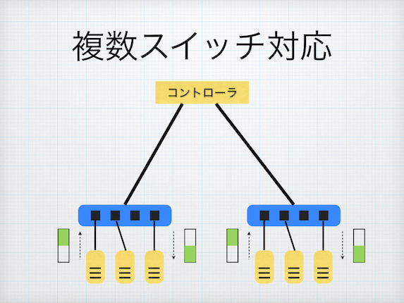

# 情報ネットワーク学演習Ⅱ 10/12 レポート課題

## 課題内容 (複数スイッチ対応版 ラーニングスイッチ)

複数スイッチに対応したラーニングスイッチ (multi_learning_switch.rb) の動作を説明しよう。

* 複数スイッチの FDB をどのように実現しているか、コードと動作を解説する
* 動作の様子やフローテーブルの内容もステップごとに確認すること
* 必要に応じて図解すること



## 解答

### コード解説
この節では、multi_learning_switch.rbの各ハンドラを説明する。
* startメソッド
```ruby
  def start(_argv)
    @fdbs = {}
    logger.info "#{name} started."
  end
```

* switch_readyメソッド
```ruby
  def switch_ready(datapath_id)
    @fdbs[datapath_id] = FDB.new
  end
```

* packet_inメソッド
```ruby
  def packet_in(datapath_id, packet_in)
    return if packet_in.destination_mac.reserved?
    @fdbs.fetch(datapath_id).learn(packet_in.source_mac, packet_in.in_port)
    flow_mod_and_packet_out packet_in
  end
```

* age_fdbsメソッド
```ruby
  def age_fdbs
    @fdbs.each_value(&:age)
  end
```

* flow_mod_and_packet_outメソッド
```ruby
  def flow_mod_and_packet_out(packet_in)
    port_no = @fdbs.fetch(packet_in.dpid).lookup(packet_in.destination_mac)
    flow_mod(packet_in, port_no) if port_no
    packet_out(packet_in, port_no || :flood)
  end
```

* flow_modメソッド
```ruby
  def flow_mod(packet_in, port_no)
    send_flow_mod_add(
      packet_in.datapath_id,
      match: ExactMatch.new(packet_in),
      actions: SendOutPort.new(port_no)
    )
  end
```

* packet_outメソッド
```ruby
  def packet_out(packet_in, port_no)
    send_packet_out(
      packet_in.datapath_id,
      packet_in: packet_in,
      actions: SendOutPort.new(port_no)
    )
  end
```

### 動作確認
